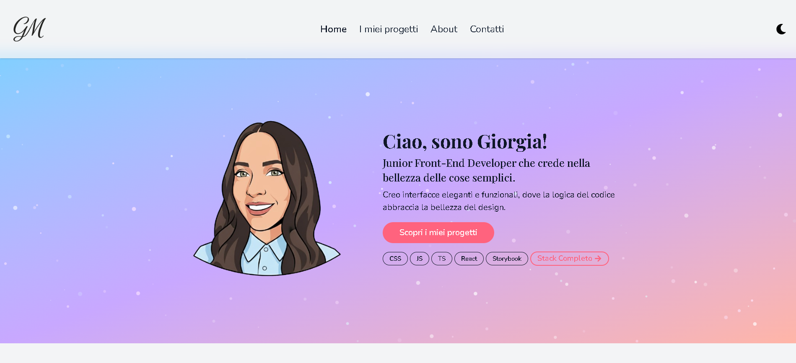
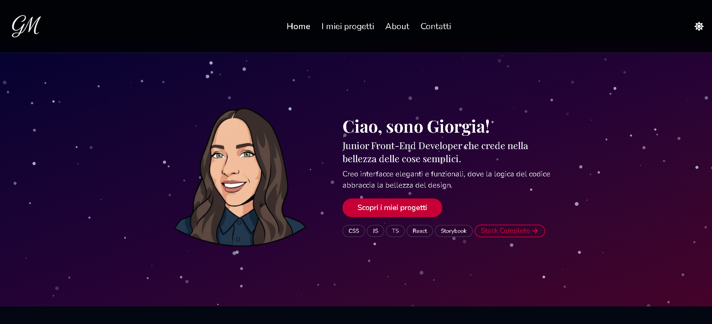
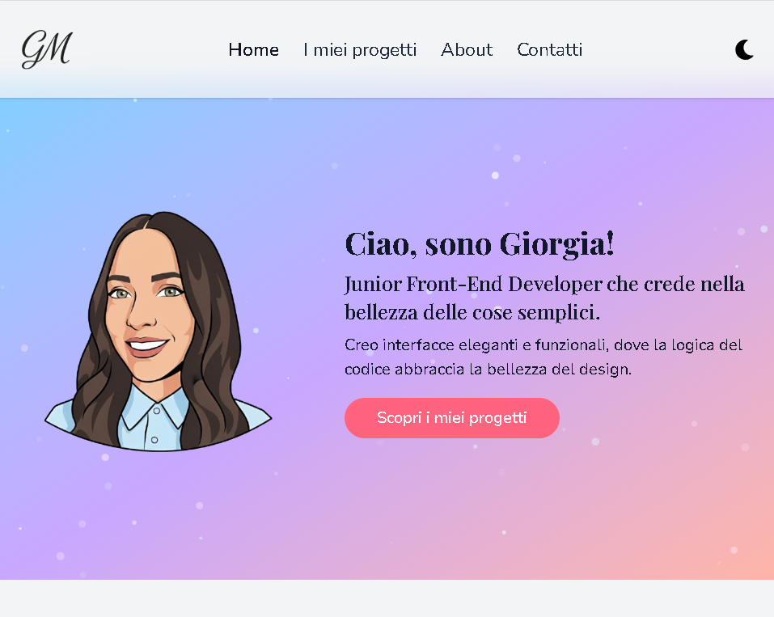

# 🌸 Portfolio – Giorgia  

Questo progetto è il mio **portfolio personale**, pensato per raccontare sia il mio percorso nello sviluppo web, sia il mio approccio al design e all’esperienza utente.

Credo nelle interfacce semplici, curate e funzionali, dove il codice non è solo tecnica, ma uno strumento per creare esperienze piacevoli e accessibili.

---

## 🎯 Obiettivo del progetto

L’obiettivo di questo portfolio è:
- presentare le mie competenze tecniche
- mostrare il mio approccio al Front-End
- raccontare il mio stile, sia visivo che di sviluppo

Ogni scelta progettuale è stata fatta cercando un equilibrio tra **estetica**, **usabilità** e **pulizia del codice**.

---

## 🛠️ Tecnologie

- **React** – sviluppo dell’interfaccia a componenti
- **TypeScript** – tipizzazione e maggiore affidabilità del codice
- **Tailwind CSS** – gestione dello stile
- **Framer Motion** – animazioni e transizioni
- **tsParticles** – sfondo animato della Hero Section
- **Vercel** – deploy

---

## 🧱 Architettura & Best Practices

Il progetto è strutturato seguendo le best practice di React:

- suddivisione in **pagine** per la navigazione principale
- utilizzo di **componenti**
- codice leggibile e facilmente manutenibile

Questo approccio rende il progetto scalabile e pronto per future evoluzioni.

---

## 🎨 UI Design & Stile

Lo stile è parte integrante del progetto.

### Palette colori & identità visiva

Ho progettato una palette moderna e coerente, con gradienti e contrasti studiati per garantire:
- buona leggibilità
- equilibrio visivo
- coerenza tra le varie sezioni

### Light & Dark Mode

Il sito supporta una **Light Mode** e una **Dark Mode**:

### 🌤️ Light Mode

- colori chiari e delicati  
- atmosfera luminosa e minimale  
- sensazione di apertura e semplicità

### 🌙 Dark Mode

- tonalità viola e blu più profonde  
- esperienza visiva più immersiva
- ideale per una navigazione serale  

La **Dark Mode** è completamente integrata:
- toggle sempre accessibile
- transizioni fluide tra i temi
- componenti adattivi
- coerenza visiva in tutte le sezioni

Il cambio di tema è pensato per essere naturale e piacevole, senza mai spezzare l’esperienza dell’utente.

---

## ✨ Hero Section & Animazioni

La **Hero Section** è stata progettata per essere immediata e coinvolgente:

- presentazione chiara del profilo
- avatar illustrato
- **sfondo animato con particelle** realizzato con **tsParticles**
- animazioni leggere gestite con **Framer Motion**

Le animazioni accompagnano l’utente senza distrarre, valorizzando i contenuti.

---

## 🎞️ Motion & Micro-interazioni

Le animazioni e le micro-interazioni hanno lo scopo di:
- migliorare la user experience
- rendere la navigazione più fluida
- guidare l’utente tra le sezioni
- valorizzare i contenuti

Ogni movimento è pensato per essere naturale e funzionale.

---

## 📱 Responsive Design

Il portfolio è completamente **responsive**, progettato per offrire un’esperienza ottimale su **desktop, tablet e mobile**.           
Il layout è stato progettato seguendo un approccio **mobile-first**, adattandosi progressivamente a schermi più grandi.          
Ogni sezione si adatta automaticamente alle dimensioni dello schermo, mantenendo leggibilità, navigazione intuitiva e coerenza visiva.

### Screenshots Responsive

| Desktop | Tablet | Mobile |
|---------|--------|--------|
|  |  |  |

---

## 🚀 Deploy

Il progetto è deployato su **Vercel**, sfruttando:
- build ottimizzate
- deploy automatici
- integrazione nativa con React

---

## 🌱 Uno spazio in evoluzione

Questo portfolio non è un punto di arrivo, ma una base solida su cui continuare a crescere, sperimentare e migliorare.

Racconta chi sono oggi, ma è pronto a cambiare con me.

---

## 💌 Contatti

Se vuoi conoscermi meglio o collaborare:

- 🌐 Portfolio: [giorgiameffe.vercel.app](https://giorgiameffe.vercel.app)
- 💼 LinkedIn: [Giorgia Meffe](https://www.linkedin.com/in/giorgia-meffe-41b23b389/)
- 📧 Email: [giorgiameffe03@gmail.com](mailto:giorgiameffe03@gmail.com)

Grazie per essere arrivato fin qui 🤍